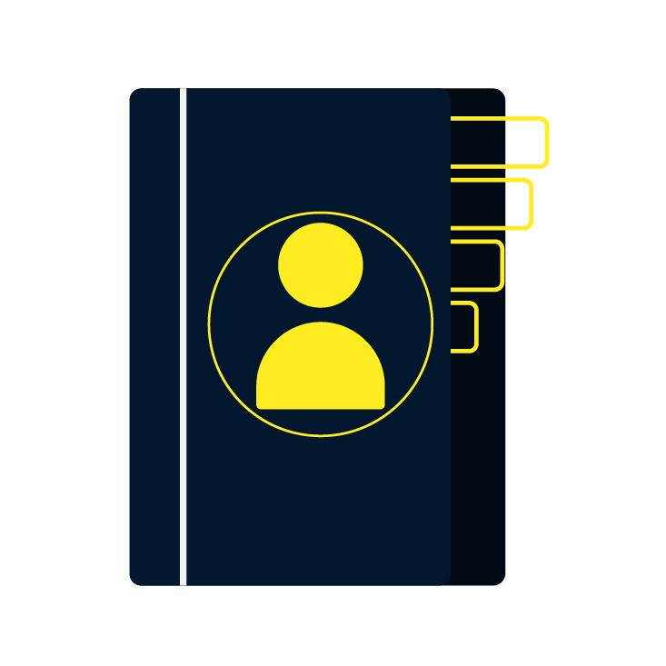

# Know The Place

  

Basic Contact App Clone using React-Redux

Built with 🤍 For You!

## Screenshots

### Home Page


## Made using

- [HTML](https://www.w3schools.com/html/)
- [CSS](https://www.w3schools.com/css/default.asp)
- [Javascript](https://www.w3schools.com/js/default.asp)
- [ReactJs](https://reactjs.org/)
- [Redux](https://redux.js.org/)
- [TailwindCSS](https://tailwindcss.com/)

## Libraries & Packages

- [React Toastify](https://fkhadra.github.io/react-toastify/introduction)

### Tools

- Illustrator
- [Figma](https://www.figma.com/)
- [VS Code](https://code.visualstudio.com/)

### Some Websites Used

- [Favicon.io](https://favicon.io/)
- [Home Page Illustration by vectorjuice](https://www.freepik.com/vectors/email-notification)

## Concepts Used

- React Redux
- React Props
- React States
- React Components
- Javascript Objects

## Run Locally

Clone the project

```bash
  git clone https://github.com/kushagra-aa/contacts-book.git
```

Go to the project directory

```bash
  cd contacts-book
```

Install dependencies

```bash
  npm i
```

Development server

Runs the app in the development mode.

```bash
  npm start
```

Open [http://localhost:3000](http://localhost:3000) to view it in the browser.
